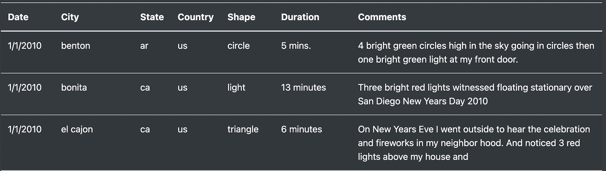

# The Wall of Weird

## Overview
Dana has compilted a lof of data on UFO sightings across the world. Originally, her goal was to create a webpage that displays all the information about the different sightings in a table format and to allow the user to be able to filter that data based on the date. I have been tasked with assisting Dana in adding more filters to the webpage so that the user can filter the data based on multiple criteria if they so choose. Including filters for the city, state, country, and shape will really allow the users of Dana's webpage to customize the webpage to their liking and get the most out of the analysis of the UFO sightings.

---
## Results
The webpage provides a table of UFO sightings with details such as the date, city, and the duration of the event:

Adding the extra filters to the webpage gives the user so many options for how to parse and analyze the data for the UFO sightings:

A helpful aspect of the input boxes is the placeholder inside them to give the user an example of what to type inside the input box so that they know the format of the text needed to filter the table. The user is able to filter the data using any of the options on the webpage. Additionally, the table can be filtered using just 1 of the filter criteria or by using any combination of the filter criteria.

### Filtering By One Search Criteria
If no text is entered into the input boxes of the filter criteria, then the complete table is presented. On the other hand, if the user wanted to filter the table by city name, they would enter the name of the city into the city input box and press enter to filter:

Entering El Cajon into the city input box produces the following table:

The resulting table lists the UFO Sightings just for the city of El Cajon.

### Filtering By More Than One Search Criteria
If the user wanted to filter by the city name and the shape of the sighitng, they would also input text into the shape input box:

Those inputs would filter the table for the city of El Cajon and for the triangle sightings:

In this case, the resulting table shows the triangle sigthings for the city of El Cajon. As previously mentioned, any combination of the input boxes can be used to fitler the UFO Sightings table.

---
## Summary
### Drawback
One drawback of the new design is that it may be difficult to filter efficiently since the user does not know what options there are to filter on for each specific search criteria. This drawback is most evident for the city, country, and shape search criteria. For the city names, the user may spend a long time inputting different cities that may not even be represented in the table before they finally input a city that actually allows the table to be filtered so they can see the UFO sightings information for that city. Similarly, since the user doesn't know what countries or what shapes are found in the table data, it would be difficult for the user to know what specific items they can use to filter. 

### Recommendations
To make it easier for the user to filter the table, it would be better to create a dropdown menu for each search criteria so that the user can just select which specific option they would like to filter by. The dropdown menu would save the user a lot of time since they would be selecting options from items that they know are already in the table data instead of having to guess at what date, city, state, country or shape is present in the table. Lastly, adding a filtering option, with a dropdown menu as well, for the duration of the UFO sighting would be another good search criteria for a user trying to find interesting information about the different kinds of UFO sightings.  